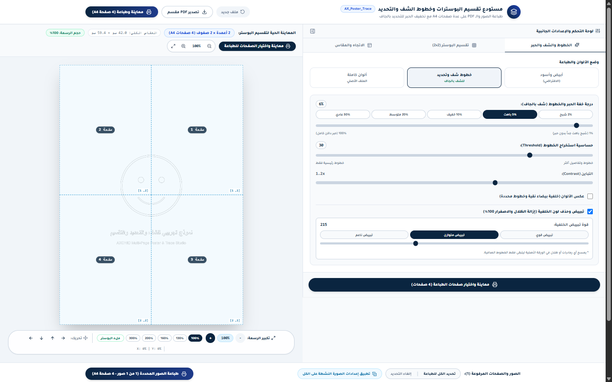
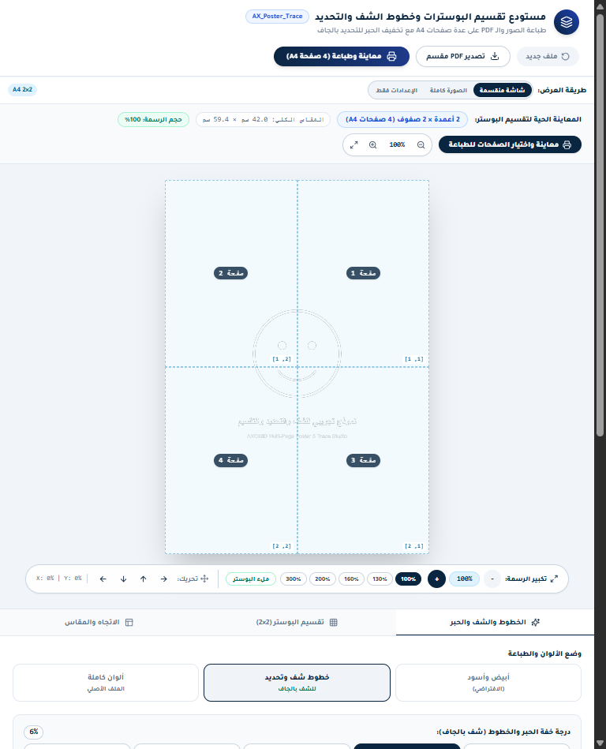
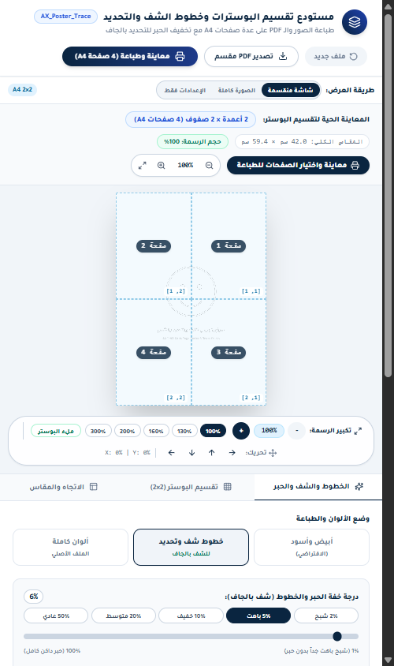
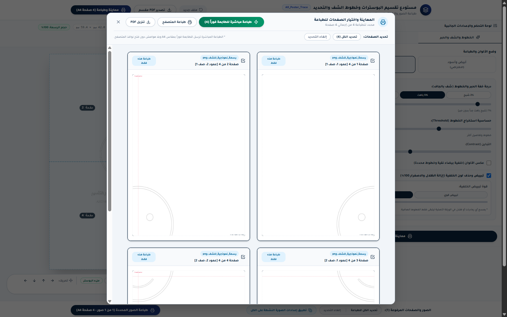
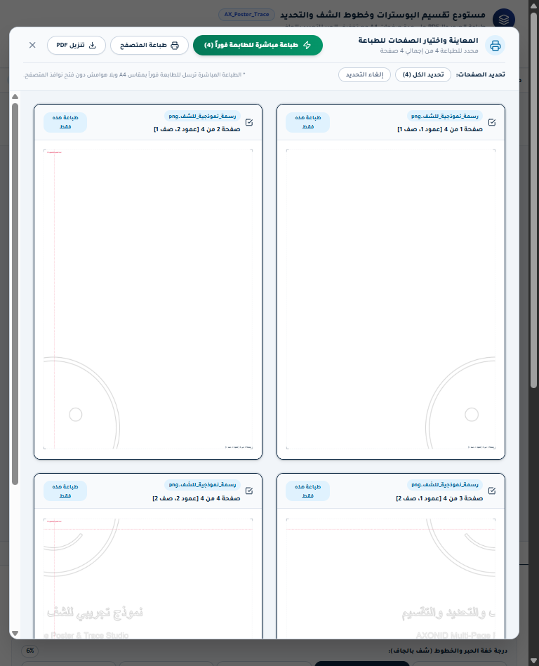
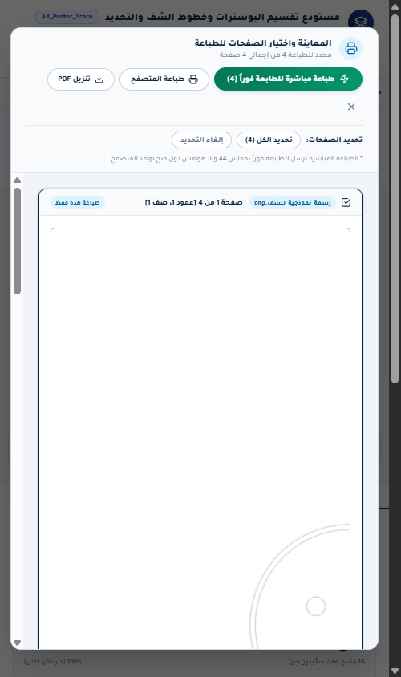

# AX_Poster_Trace

> استوديو احترافي فائق الدقة لتجزئة وطباعة البوسترات الجدارية العملاقة وتجهيز خطوط الشف والتحديد.

---

## نظرة عامة

منظومة ويب متكاملة موجهة للمطابع والمصممين وورش الخط العربي والأعمال الفنية اليدوية. يحل النظام مشكلة طباعة الرسومات والمخطوطات الضخمة على طابعات A4 المكتبية العادية عبر تقسيمها إلى شبكة هندسية محكمة مع حساب دقيق لهوامش التراكب واللصق، ودعم عزل وتبييض الخلفيات الرقمية وتخفيف الحبر لإنشاء خطوط شف (Ghost Lines) قابلة للتحديد والرسم فوقها يدوياً.

---

## المميزات الرئيسية

- **تقسيم وتجزئة البوسترات الذكي (Multi-Page Grid Slicing):** توزيع الصور وملفات الـ PDF بدقة رياضية على شبكة صفحات A4 (من 1×1 حتى 10×10) مع ترقيم الشرائح.
- **تخفيف الحبر وخطوط الشف (Ghost Trace Ink):** تقليل عتامة الحبر إلى نسب منخفضة جداً (من 1% إلى 100%) لتمكين الفنانين والخطاطين من الشف اليدوي.
- **عزل وتبييض الخلفيات التلقائي (Auto Background Remover & Whitening):** خوارزمية ذكية لمسح الظلال والاصفرار وتبييض الورق 100% لإبقاء الخطوط النقية فقط.
- **التحكم الحر بحجم وموضع الرسمة (Pan & Zoom Scaling):** تكبير أو تصغير الرسمة داخل إطار البوستر وتحريكها بحرية بدون قص أطرافها.
- **شريط إدارة وطباعة الدفعات (Multi-Image Batch Queue):** رفع عدة صور في آن واحد وتحديد الصور المراد طباعتها دفعة واحدة بضغطة زر.
- **لوحة تحكم جانبية متجاوبة (Responsive Studio Control Drawer):** واجهة مستخدم مظلمة فائقة الجمال متوافقة كلياً مع الحواسيب والأجهزة اللوحية والموبايل.
- **معاينة وطباعة شرائح A4 مباشرة (Direct & Native Print Preview):** نافذة لاختيار الصفحات المطلوبة وطباعتها بأعلى دقة دون هوامش تشويه أو تنزيلها كملف PDF مجمع.

---

## الصفحات

### استوديو تفريغ وتقسيم البوسترات (Studio Main)
| Desktop | Tablet | Mobile |
|---|---|---|
|  |  |  |

---

### معاينة واختيار شرائح الطباعة (Print Modal)
| Desktop | Tablet | Mobile |
|---|---|---|
|  |  |  |

---

## التقنيات المستخدمة

| Layer | Technology |
|---|---|
| Frontend | React 18 + Vite 5 + Tailwind CSS |
| UI & Icons | Lucide React + Glassmorphism Cyber Theme |
| Image Processing | HTML5 Canvas API + In-Memory Pixels Transformer |
| Document Engine | PDF.js (Mozilla) + Vector Canvas Renderer |
| Hosting & Tunnel | Cloudflare Tunnel + Vite PWA Ready |
| Language & Style | RTL First (Arabic) + Cairo / Tajawal Fonts |

---

*Generated by AX Portfolio Capture — 2026-09-05*
